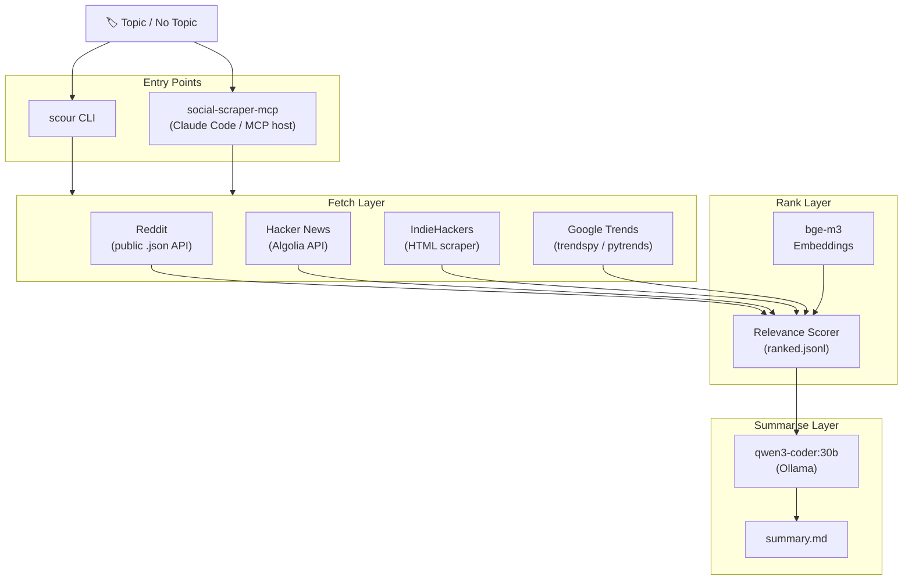

<div align="center">

# 🔍 SocialScour

**Multi-source social aggregator for rapid topic research.**  
Given a topic, pull Reddit + Hacker News + IndieHackers + Google Trends into a single ranked Markdown digest — locally, privately, free.

[](https://www.python.org/)
[](https://ollama.com)
[](https://www.reddit.com)
[](https://hn.algolia.com/api)
[](https://pypi.org/project/trendspy/)

[](https://github.com/Quadstronaut/SocialScour/commits/master)
[](https://github.com/Quadstronaut/SocialScour)
[](https://github.com/Quadstronaut/SocialScour)

---

[](#overview)
[](#install)
[](#quick-start)
[](#cli-reference)
[](#mcp-setup)
[](#configuration)
[](#output-structure)
[](#sources)

</div>

---

<a id="overview"></a>
## 🗺️ Overview

SocialScour answers the question: *"Is this a real problem people care about?"*  
It fetches, ranks, and summarises posts across four social platforms using a local Ollama LLM — no cloud API keys, no data leaving the box. The output artifact is a plain `.md` file ready for decision-support.

### At a Glance

| Dimension | Detail |
|---|---|
| **Data sources** | Reddit, Hacker News, IndieHackers, Google Trends |
| **LLM backend** | Ollama (always) — `qwen3-coder:30b` for reasoning, `bge-m3` for embeddings |
| **Entry points** | `scour` CLI · `social-scraper-mcp` MCP server |
| **Auth required** | None (public APIs and scrapers only) |
| **Output** | Ranked Markdown digest + full audit trail (`ranked.jsonl`, `meta.json`) |
| **Cache** | SQLite — 30-day TTL, keyed by post ID + model + role |
| **Privacy** | All data on-box |

### Entry Points

| Entry point | Driver | Command |
|---|---|---|
| `scour` CLI | Ollama (local, free) | `scour ask "your topic"` |
| `social-scraper-mcp` | Ollama (MCP tools) | See [MCP Setup](#mcp-setup) |

---

<a id="data-flow"></a>
## 🔄 Data Flow



---

<a id="requirements"></a>
## ⚙️ Requirements

- **Python** ≥ 3.11
- **[Ollama](https://ollama.com)** running locally (`ollama serve`)
- Models pulled:

```bash
ollama pull qwen3-coder:30b   # reasoning / summarization
ollama pull bge-m3:latest     # embeddings (relevance ranking)
```

- `trendspy` or `pytrends` for Google Trends (installed automatically)

---

<a id="install"></a>
## 📦 Install

```bash
git clone https://github.com/Quadstronaut/SocialScour.git
cd SocialScour
pip install -e .
```

Confirm the install:

```bash
scour --help
```

---

<a id="quick-start"></a>
## 🚀 Quick Start

```bash
# Research a topic across all four sources (30-day window)
scour ask "local LLM coding assistants"

# Pin specific subreddits when you know the community (bypasses LLM discovery)
scour ask "Linux server hardening audit tools" \
  --subreddits sysadmin,selfhosted,linuxadmin,devops,cybersecurity \
  --window-days 90

# Narrow to specific sources
scour ask "open source billing tools" --sources reddit,hn --window-days 14

# --summarizer claude is accepted but has no effect; Ollama is always used
scour ask "container orchestration trends" --summarizer claude

# Discover what's trending without a topic
scour discover --top-n 5 --window-days 7

# Browse past runs
scour list
scour timeline <slug>
```

The interactive PowerShell launcher (`Scour-Sentiments.ps1`) wraps these commands with menus if you prefer not to type flags.

> [!TIP]
> Always run `scour` from the repo root, or pass `--out` with an absolute path. The defaults (`data/`, `cache/`) resolve relative to your **current working directory**.

---

<a id="cli-reference"></a>
## 📖 CLI Reference

<a id="scour-ask"></a>
### `scour ask <TOPIC>`

Fetch + rank + summarise posts about `TOPIC`. Writes `data/runs/<slug>_<timestamp>/summary/summary.md`.

| Flag | Default | Description |
|---|---|---|
| `--window-days N` | `30` | How far back to look (days) |
| `--sources LIST` | all | Comma-separated: `reddit,hn,indiehackers,trends` (aliases: `ih`, `google_trends`) |
| `--subreddits LIST` | *(auto-discover)* | Comma-separated subreddit names; bypasses LLM-driven discovery |
| `--model MODEL` | `qwen3-coder:30b` | Ollama model for summarization |
| `--summarizer NAME` | `ollama` | Accepted and stored in `meta.json`; has no effect on pipeline execution |
| `--out PATH` | `data` | Root folder for run output |

<a id="scour-discover"></a>
### `scour discover`

Fetch trending titles from configured sources, pick the top-N, and run `ask` on each.

| Flag | Default | Description |
|---|---|---|
| `--window-days N` | `30` | Lookback window |
| `--top-n N` | `5` | How many trending topics to dig into |
| `--sources LIST` | all | Same aliases as `ask` |
| `--model MODEL` | `qwen3-coder:30b` | Ollama model |
| `--out PATH` | `data` | Output root |

> [!NOTE]
> `scour discover` uses a simple pick-first driver, not the full `smolagents.CodeAgent` loop described in the design spec. Functional for most use cases.

<a id="scour-timeline"></a>
### `scour timeline <SLUG>`

Print the chronological digest history for a topic slug (stored in `data/topics/<slug>/timeline.md`).

<a id="scour-list"></a>
### `scour list`

List recent runs newest-first.

| Flag | Default | Description |
|---|---|---|
| `--data-root PATH` | `data` | Output root |
| `--limit N` | `20` | Max rows to show |

---

<a id="mcp-setup"></a>
## 🔌 MCP Setup

`social-scraper-mcp` exposes four tools to Claude Code (or any MCP host):

| Tool | Returns | Description |
|---|---|---|
| `ask` | `{run_dir, summary_path, one_line_status}` | Run the `ask` pipeline. Returns paths only — no content |
| `discover` | `{run_dir, summary_path, one_line_status}` | Run the `discover` loop. Same shape |
| `read_summary` | file content | Read `summary.md` from a `run_dir` |
| `read_timeline` | file content | Read the timeline for a topic slug |

`ask` and `discover` return only paths. Call `read_summary` or `read_timeline` as the explicit opt-in to retrieve content.

### Add to Claude Code config

Add to `.claude/settings.json` (project) or the global settings file:

```json
{
  "mcpServers": {
    "social-scraper": {
      "command": "social-scraper-mcp"
    }
  }
}
```

> [!IMPORTANT]
> The MCP server requires Ollama to be running. If Ollama is unreachable, `ask`/`discover` return `{"error": "ollama_unreachable", ...}`.

> [!WARNING]
> **Known limitation:** `_impl_ask` in the MCP server does not expose a `subreddits` parameter. Until that is added, subreddit discovery always uses the LLM path. Use the `scour` CLI with `--subreddits` if you need to pin communities.

---

<a id="configuration"></a>
## 🛠️ Configuration

No config file — all settings are CLI flags or environment variables:

| Env var | Default | Description |
|---|---|---|
| `OLLAMA_BASE_URL` | `http://localhost:11434` | Ollama server URL |
| `OLLAMA_TIMEOUT` | `1800` | Per-request timeout in seconds |
| `REDDIT_USER_AGENT` | *(generic UA string)* | Override the Reddit user-agent |

---

<a id="output-structure"></a>
## 📂 Output Structure

Each run writes to `data/runs/<slug>_<timestamp>/`:

```
data/runs/<slug>_<timestamp>/
├── meta.json          ← run parameters, per-source stats, warnings, topic-confidence
├── raw/               ← raw fetched posts per source (.jsonl) + Google Trends blob (.json)
├── ranked.jsonl       ← all posts with relevance scores and reasons (full audit trail)
└── summary/
    └── summary.md     ← the final digest
```

Per-topic history: `data/topics/<slug>/timeline.md`

The LLM call cache lives at `cache/ollama_calls.sqlite` (30-day TTL, keyed by post ID + model name + role).

---

<a id="sources"></a>
## 📡 Sources

| Source | Mechanism | Notes |
|---|---|---|
| Reddit | Public JSON API (no auth, no PRAW) | Rate-limited (2 s + jitter). Returns 403 if user-agent is flagged. |
| Hacker News | Algolia search API | Free, no auth. Fetches stories and comments. |
| IndieHackers | HTML scraper (BeautifulSoup) | Fixed to the `ideas-and-validation` category. Brittle to HTML changes. |
| Google Trends | `trendspy` (primary) / `pytrends` (fallback) | Unofficial API; occasional 429s treated as best-effort. |

> [!NOTE]
> Reddit requires **no API credentials** — the client uses the public `.json` endpoint. If Reddit starts returning 403s, try setting a descriptive `REDDIT_USER_AGENT` value.

---

<a id="known-issues"></a>
## 🐛 Known Issues & Gaps

<details>
<summary>Expand known issues</summary>

- **Relative path defaults** — `data/` and `cache/` resolve relative to CWD. Run from the repo root or use `--out` with an absolute path.
- **`--summarizer claude` has no effect** — the flag is accepted and stored in `meta.json` but nothing in the pipeline branches on it. Ollama is always used for all pipeline steps.
- **LLM-driven subreddit discovery** selects general communities for niche topics. Use `--subreddits` to pin communities when you know them.
- **`scour discover` uses a simple pick-first driver**, not the full `smolagents.CodeAgent` loop described in the design spec. Functional for most use cases.
- **MCP `ask` tool missing `subreddits` param** — pin subreddits via the CLI for now.
- No `--version`, `--dry-run`, `--explain`, or `scour doctor` subcommand yet.

</details>

---

<a id="development"></a>
## 🧪 Development

```bash
pip install -e ".[dev]"

# Fast unit tests (no network, no Ollama)
pytest -m component

# Full workflow tests with fakes
pytest -m workflow

# All non-e2e tests
pytest

# Live e2e (requires running Ollama + real APIs)
pytest tests/e2e --e2e -v
```

---

<a id="license"></a>
## 📄 License

MIT. See source headers. Author: Kyle Green (Quadstronaut).

Wiki: [github.com/Quadstronaut/SocialScour/wiki](https://github.com/Quadstronaut/SocialScour/wiki)
